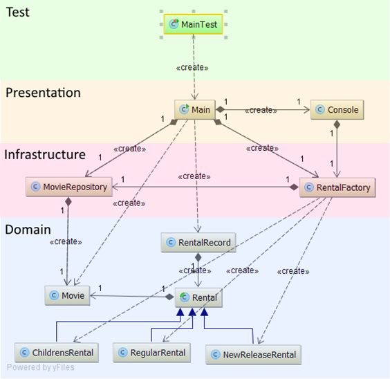

# 100 baby steps away from spaghetti code
An emerging design workshop

[Original Java version by Rick Janda](https://github.com/rickjanda/commandline-videostore)

Ported to C++ by [Arne Mertz](https://github.com/arnemertz)

---
## What is spaghetti code?
**Low cohesion**
- Multiple concerns or responsibilities are entangled with each other in single methods, classes or packages

**High coupling**
- Classes and methods depend on many other classes
- State and logic are separated

**Missing abstractions**
- No classes representing domain concepts or technical responsibilities

---
## Emerging design - basic idea

Use refactoring to bring state and logic together in meaningful new classes

1. Extract some logic into methods
2. Wrap state with a new class
3. Move extracted methods into the new class  
(steps 1 and 2 are interchangeable)

---
##Emerging design process

1. _Separate responsibilities within a function_
2. **Extract private functions**
3. _Remove direct access to fields other than those of the new class_
4. **Wrap target state with domain specific class**
5. **Move methods to the target class as public**
6. _Simplify parameters to remove unwanted dependencies_

---
## What does baby step refactoring mean?

- Split large refactorings into many small steps
- The code is compilable and the tests are green after every step
- If you can not make the code compilable and the tests green within
30 seconds, roll back to last green state

---
## Why?

- Avoids merging nightmare
- Avoids debugging hell
- Avoids analysis paralysis
- Allows us to fix bugs or start other work at any time
- Easier to deal with interruptions
- Allows us to tackle technical debt step-wise

Taking small steps makes you fall over less often!

---
## Technique: Parallel Change

1. Create new structure in parallel to existing one
2. Step-wise add write accesses to new structure next to each write access to existing structure
3. Step-wise switch read accesses from old to new structure
4. Remove old structure
5. _Clean up_

**Run tests after each baby step & commit frequently**

---
## Preparation

**Clone the repository**
https://github.com/arnemertz/commandline-videostore-cpp

**Import the project to your IDE**  
(The IDE should have good refactoring tools, e.g. CLion, ReSharper++)

**Compile and run the test**

---
### Optional: Find the smells

### Optional: Identify domain concepts

---
## What we are going to do:

**In 10 rounds:**
- Extract domain concepts and logic into domain classes
- Separate infrastructure logic into infrastructure classes
- Separate presentation logic with a kind of MVC pattern

**Focus on baby step refactoring and emerging design techniques**

For timing reasons we skip low level code polishing and long
discussions of other design options.

---

---
If you get "lost" or mess up your code: for each excercise there is a branch
you can check out (E0..E9)

---
## E0: Extract helper function to split strings

- In order to remove code duplication
- Create the function

      std::vector<std::string> split(const std::string& str, char delimiter)
- Extract the two places where strings are split into functions
- Refactor until they are identical
- Reduce to a single function

---
## E1: Extract domain concept - introduce Movie struct

- In order to remove the Primitive Pbsession smell  
_Primitive Obsession_: using primitive data types instead of classes
to represent domain ideas.

- `Movie` is just a bunch of data, i.e. a struct suffices.
- Use the parallel change technique
- No logic to move into `Movie`

---
## Technique: Narrow Change

Reduce amount of similar manual changes by means of the duplication
detection in some automated refactorings:

- Introduce indirection by automated refactoring
    - Extract Method; or
    - Extract local variable; or
    - Introduce factory method (for constructors)
- Manual change in one place → **Run your tests**
- Inline indirection again

---
## E2: Extract domain concept - Introduce Rental class

- In order to remove the Primitive Obsession smell
- `Rental` should get the following constructor:

      public Rental(Movie const& movie, int daysRented)

- Extract and move the following logic into `Rental`:
    - `double getAmount() const`
    - `int getFrequentRenterPoints() const`
    - `string const& getMovieName() const`
- Parsing logic should be kept in the `run` function

---
## Technique: Loop Splitting

If the body of a loop contains several responsibilities that we want to
separate we have to duplicate the loop and keep only one
responsibility in every loop body.

- Create a container in the first loop and iterate over it in the following loops
- This approach of duplicating the control structure is also feasible for
other control structures with several responsibilities in the body.

---
## E3: Extract infrastructure logic - Introduce MovieRepository class

- Extract file reading and parsing logic for `Movie` into a new
`MovieRepository` class
- The printout of the movie list must _not_ be moved into the `MovieRepository`
- The `MovieRepository` should get two methods:
    - `std::vector<Movie> getAll() const`
    - `const Movie& getByKey(int key) const`
- The `MovieRepository` should read from the file in its constructor

---
## E4: Extract Infrastructure Logic - Introduce RentalFactory class
   
- In order to separate the creation logic of `Rental`
- Keep the presentation logic in `run` for now
- The `RentalFactory` should get the following method:
    - `Rental createRental(const std::string& input)`
- ... and hold a reference to the `MovieRepository` which is injected to it

---
## E5: Split the while loop

- Into 4 loops with a single responsibility each
- Extract the following methods:
    - `std::vector<Rental> inputRentals(std::istream& in, RentalFactory& rentalFactory)`
    - `int getFrequentRenterPoints(std::vector<Rental> const& rentals)`
    - `double getTotalAmount(std::vector<Rental> const& rentals)`

---
## E6: Extract Domain concept - Create RentalRecord class

- Holding a `std::vector<Rental>` and `customerName`
- The `RentalRecord` class should get the following methods:
    - `getTotalAmount()`
    - `getFrequentRentersPoints()`
    - `getCustomerName()`

- Presentation logic (everthing accessing `in` or `out`) must be kept in `run` for now

---
## E7: Extract Presentation Logic - Introduce Console class
   
- That wraps `in` and `out`
- The `run` function should remain as a controller with a single level of abstraction
(SLoA) and all details moved out to other functions and classes.

---
## Technique: Duplicate and Reduce
   
A technique to split methods containing multiple responsibilities needed
by different callers:
   
1. Duplicate the method by:
    - Copy and paste (plus rename); or
    - Pull member down to all subclasses; or
    - Inline method implementation at caller side
2. Reduce both copies to what is needed for the specific caller or in the given scope

---
## Technique: Introduce Polymorphism

1. Encapsulate constructor with static factory method
2. Create empty subclasses with the same constructor signatures like the 
parent class, only passing all parameters by super(…).
3. Instantiate subclasses instead of parent class in static factory method
    - with switch case or if/else blocks switching on the according type parameter
4. Declare parent class abstract
5. Use duplicate and reduce to move logic into subclasses and simplify
them (push members down or copy/paste for duplicate)

--- 
## E8: Introduce polymorphism for Rental
   
- Based on `movie.category`  

**E8a**: `RentalFactory::createRental(const std::string& input)` has to be
changed to return a `unique_ptr<Rental>`

**E8b**:
- Create a `RegularRental`, a `ChildrensRental` and a `NewReleaseRental`
- Remove the simulated polymorphic behavior
- First: create and instantiate skeletons for subclasses
- Second: Use Duplicate&Reduce

---
## What techniques we have learned:

- Parallel change
- Narrow change
- Loop splitting
- Duplicate and reduce
- Separate responsibilities and concerns
- Emerge compositions and inheritance
- Code generation, refactorings, IDE suggestions to improve
productivity.

Hint: Learn your IDE shortcuts (The mouse is your enemy ;-)
